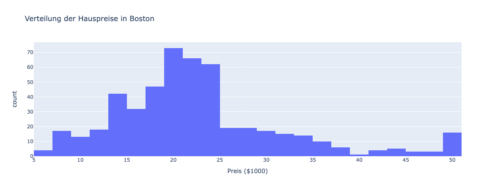
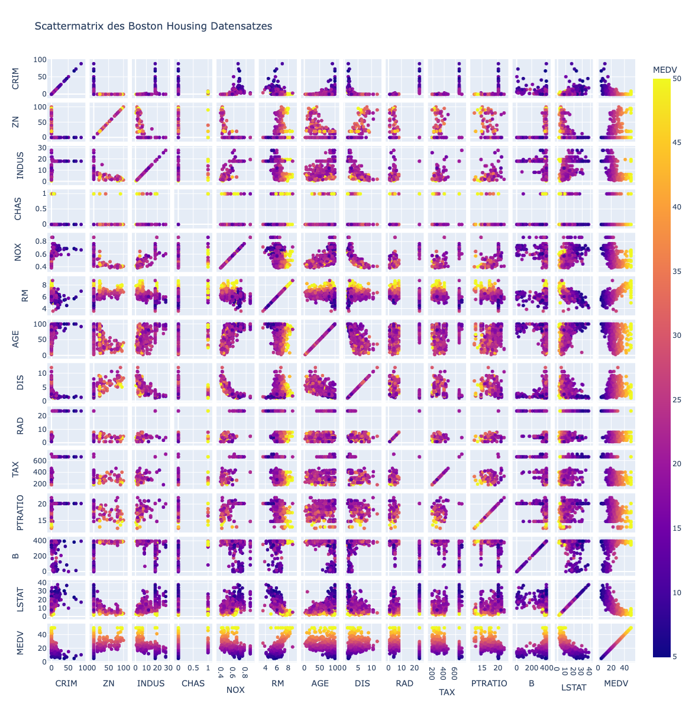
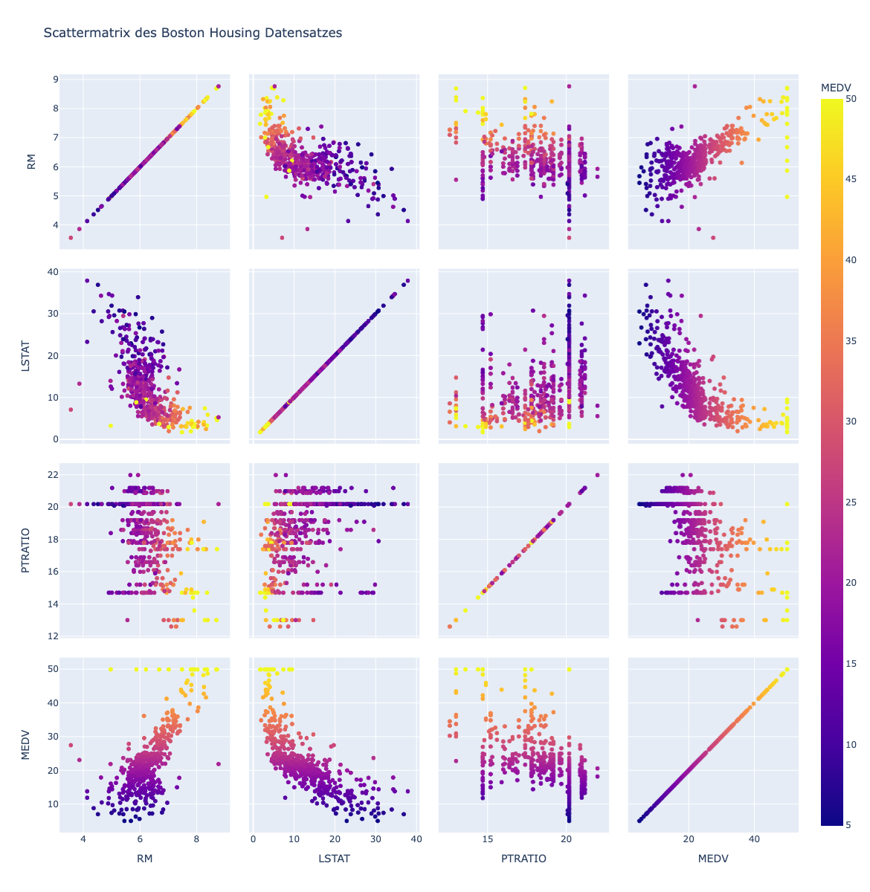

---
jupytext:
  formats: ipynb,md:myst
  text_representation:
    extension: .md
    format_name: myst
    format_version: 0.13
    jupytext_version: 1.14.4
kernelspec:
  display_name: Python 3
  language: python
  name: python3
---

# Histogramme und Scattermatrix

## Lernziele

```{admonition} Lernziele
:class: hint
* Sie wissen, was ein **Histogramm** ist und können es mit Plotly erzeugen.
* Sie wissen, was eine **Scattermatrix** ist und können sie mit Plotly erzeugen.
```

## Histogramme

Histogramme sind eine der wichtigsten Arten von Diagrammen, wenn es darum geht,
die Verteilung von Daten zu visualisieren. Ein Histogramm zeigt die Häufigkeit
der Werte in einem Datensatz in Form von Balken. Die Höhe jedes Balkens gibt an,
wie oft ein bestimmter Wert im Datensatz vorkommt. Aus der Schule sind die
Histogramme sehr bekannt, denn üblicherweise wird bei der Rückgabe der
Klassenarbeit der sogenannte Notenspiegel angegeben. Darin enthalten ist, wie
oft die Note sehr gut, wie oft die Note gut usw. erreicht wurde.

In Plotly Express ist das Erstellen eines Histogramms einfach und schnell. Mit
nur wenigen Zeilen Python-Code können wir ein Histogramm erstellen, das uns
einen Einblick in die Verteilung der Daten gibt. Hier ist ein Beispiel mit dem
Boston Housing Datensatz:

```python
import pandas as pd
import plotly.express as px

# Laden des Boston Housing Price Datensatzes
df = pd.read_csv("https://archive.ics.uci.edu/ml/machine-learning-databases/housing/housing.data",
                 header=None, delim_whitespace=True,
                 names=['CRIM', 'ZN', 'INDUS', 'CHAS', 'NOX', 'RM', 'AGE', 'DIS', 'RAD', 'TAX', 'PTRATIO', 'B', 'LSTAT', 'MEDV'])

# Erstellen des Histogramms
fig = px.histogram(df, x='MEDV', nbins=30,
                   labels={'MEDV': 'Preis ($1000)', 'count': 'Anzahl der Häuser'},
                   title='Verteilung der Hauspreise in Boston')

fig.show()
```



In diesem Beispiel erstellen wir ein Histogramm, das die Verteilung der
Hauspreise in Boston darstellt. Wir verwenden das "MEDV"-Feature als x-Achse,
das den Medianwert des Hauspreises darstellt, und den nbins-Parameter, um die
Anzahl der Balken im Histogramm festzulegen. Wir haben auch die Beschriftungen
der x-Achse und y-Achse angepasst und dem Histogramm einen Titel gegeben. Im
Gegensatz zu der Achsenbeschriftung bei den Streudiagrammen wird hier das
Argument `labels` verwendet. Bevor das Diagramm visualisiert wird, passiert
nämlich einiges. Zuerst unterteilt Python die Hauspreise in 30 Kategorien, was
durch das Argument `nbins=` (number of bins) festgelegt wurde. Danach wird
gezählt, wie viele Häuser aufgrund ihres Preise in die jeweilige Kategorie
fallen und diese Anzahl wird intern als `count` abgespeichert. Würden wir die
Zeile `labels` weglassen, wäre die x-Achsenbschriftung `MEDV` und die y-Achse
würde mit `count`beschriftet. Daher werden hier noch die automatisch gesetzten
Achsenbeschriftungen überschrieben. Das passiert durch die Schreibweise mit den
geschweiften Klammern und dem Doppelpunkte (präziser mit einem Dictionary). 

Histogramme sind nützlich, um zu verstehen, wie die Daten in einem Datensatz
verteilt sind. Sie zeigen uns, welche Werte im Datensatz am häufigsten vorkommen
und wie weit die Verteilung auseinanderliegt.

## Scattermatrix

Eine Scattermatrix ist eine nützliche Visualisierungstechnik, die es ermöglicht,
die Beziehungen zwischen mehreren Variablen in einem Datensatz darzustellen.
Dabei werden alle Kombinationen von zwei Variablen als Scatterplots auf einer
einzigen Seite dargestellt. Eine Scattermatrix ist besonders nützlich, um Muster
und Trends in den Daten zu identifizieren und Zusammenhänge zwischen Variablen
zu untersuchen.

In Plotly Express ist das Erstellen einer Scattermatrix einfach und schnell. Mit
nur wenigen Zeilen Python-Code können wir eine Scattermatrix erstellen, die uns
einen Einblick in die Beziehungen zwischen den verschiedenen Variablen im
Datensatz gibt. Hier ist ein Beispiel mit dem Boston Housing Datensatz:

```python
# Erstellen der Scattermatrix
fig = px.scatter_matrix(df, color='MEDV', title='Scattermatrix des Boston Housing Datensatzes', height=1200)
fig.show()
```



In diesem Beispiel erstellen wir eine Scattermatrix, die alle Kombinationen von
Variablen im Boston Housing Datensatz darstellt. Wir verwenden das
'color'-Argument, um die Farbe der Scatterplots entsprechend des Hauspreises
('MEDV') zu setzen. Wir haben auch dem Diagramm einen Titel gegeben.

Die Scattermatrix gibt uns eine Übersicht über die Beziehungen zwischen den
verschiedenen Variablen im Boston Housing Datensatz. Wir können sehen, dass es
eine starke positive Korrelation zwischen dem Hauspreis und der Anzahl der
Zimmer gibt, während es eine negative Korrelation zwischen dem Hauspreis und dem
Anteil der niedrigen Einkommen in der Nachbarschaft ('LSTAT') gibt. Die
Scattermatrix ist eine nützliche Möglichkeit, um Muster und Trends in den Daten
zu erkennen und Zusammenhänge zwischen Variablen zu untersuchen.

Insgesamt ist es bei 14 Merkmalen nicht so einfach, in der Scattermatrix den
Überblick zu behalten. Es kann daher sinnvoll sein, sich nicht alle Merkmale auf
einmal anzusehen, sondern nur eine Auswahl wie in dem folgenden Beispiel. Die
Merkmale, die mit in die Scattermatrix einbezogen werden sollen, werden über
eine Liste mit dem Argument `dimensions` gesetzt. 

In diesem Beispiel haben wir die Scattermatrix auf vier Variablen beschränkt:
die Anzahl der Zimmer ('RM'), den Anteil der niedrigen Einkommen in der
Nachbarschaft ('LSTAT'), das Schüler-Lehrer-Verhältnis ('PTRATIO') und den
Hauspreis ('MEDV').

```python
fig = px.scatter_matrix(df, dimensions=['RM', 'LSTAT', 'PTRATIO', 'MEDV'],
                        color='MEDV', title='Scattermatrix des Boston Housing Datensatzes', height=1200)
fig.show()
```



Mit der geringeren Auswahl an Merkmalen fällt es uns nun auch leichter, die
Scattermatrix zu interpretieren. Jeder Punkt in dem Scatterplot repräsentiert
ein Haus. Die Position des Punktes auf der x-Achse zeigt den Wert der ersten
Variable (z.B. die Anzahl der Zimmer) für dieses Haus an, während die Position
auf der y-Achse den Wert der zweiten Variable (z.B. den Hauspreis) darstellt.

Die Farbe der Punkte auf jedem Scatterplot gibt den Wert der dritten Variable
(z.B. Hauspreis) für das entsprechende Haus an. Die Farbskala reicht von
dunkellila (niedriger Wert) bis gelb (hoher Wert).

Die Scattermatrix zeigt, dass es eine starke positive Beziehung zwischen der
Anzahl der Zimmer und dem Hauspreis gibt, was zu erwarten ist (Diagramm unten,
erste Spalte). Ebenfalls zu erwarten ist eine negative Beziehung zwischen dem
Anteil der niedrigen Einkommen in der Nachbarschaft und dem Hauspreis (Diagramm
unten, zweite Spalte). Eine geringe negative Beziehung gibt es auch zwischen dem
Schüler-Lehrer-Verhältnis und dem Hauspreis (Diagramm unten, dritte Spalte).

Die Diagonale eines Scatterplots zeigt die Beziehung zwischen einer Variablen
und sich selbst an. Da die Variable natürlich perfekt mit sich selbst korreliert
ist, zeigt die Diagonale immer eine lineare Korrelation an (Diagramm unten,
vierte Spalte).


## Weiteres Lernmaterial

<iframe width="560" height="315" src="https://www.youtube.com/embed/a982sb3bDD0" title="YouTube video player" frameborder="0" allow="accelerometer; autoplay; clipboard-write; encrypted-media; gyroscope; picture-in-picture; web-share" allowfullscreen></iframe>

<iframe width="560" height="315" src="https://www.youtube.com/embed/IXOE-IPFuFc" title="YouTube video player" frameborder="0" allow="accelerometer; autoplay; clipboard-write; encrypted-media; gyroscope; picture-in-picture; web-share" allowfullscreen></iframe>

<iframe width="560" height="315" src="https://www.youtube.com/embed/XkE6YRR6voU" title="YouTube video player" frameborder="0" allow="accelerometer; autoplay; clipboard-write; encrypted-media; gyroscope; picture-in-picture; web-share" allowfullscreen></iframe>

<iframe width="560" height="315" src="https://www.youtube.com/embed/a982sb3bDD0" title="YouTube video player" frameborder="0" allow="accelerometer; autoplay; clipboard-write; encrypted-media; gyroscope; picture-in-picture; web-share" allowfullscreen></iframe>