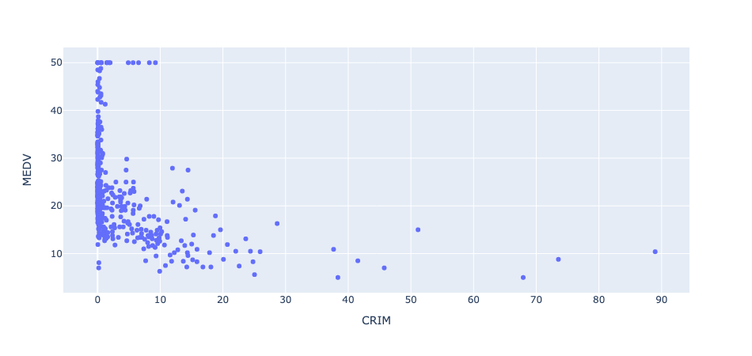
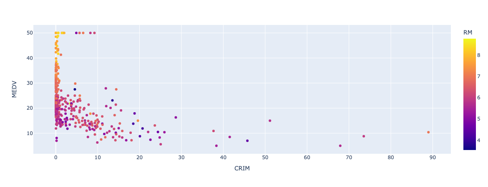
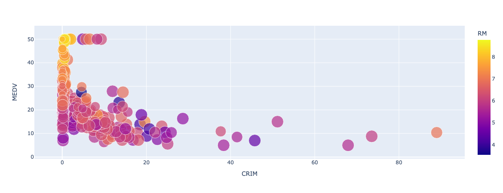
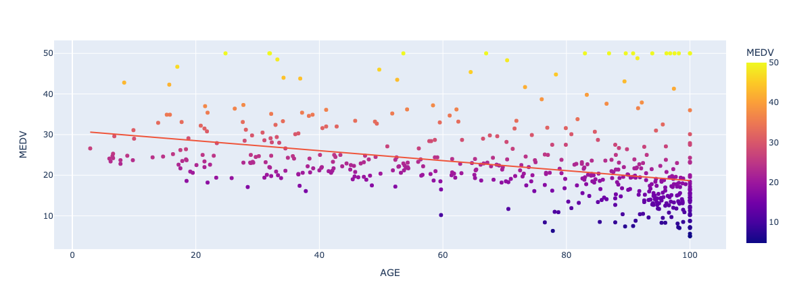
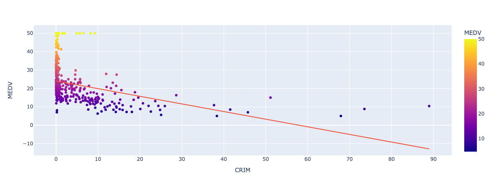
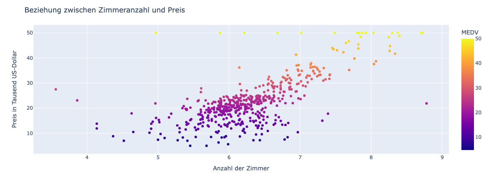
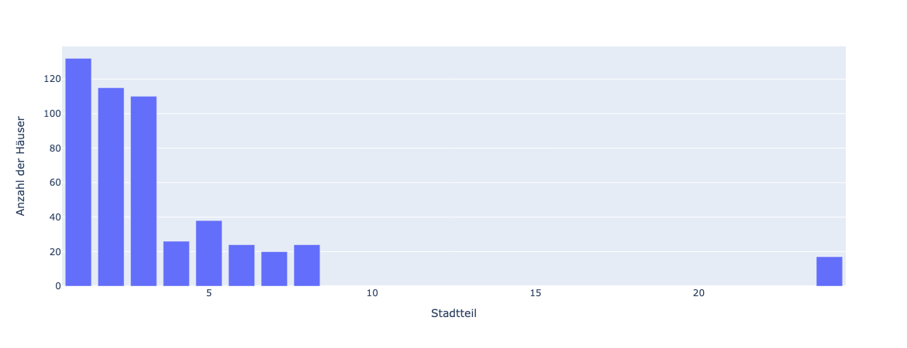
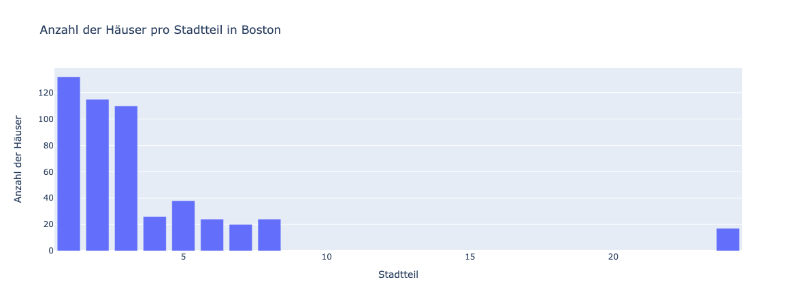

---
jupytext:
  formats: ipynb,md:myst
  text_representation:
    extension: .md
    format_name: myst
    format_version: 0.13
    jupytext_version: 1.14.4
kernelspec:
  display_name: Python 3
  language: python
  name: python3
---

# Streudiagramm und Balkendiagramm 

Plotly Express unterstützt eine Vielzahl von Diagrammtypen, darunter
Liniendiagramme, Balkendiagramme, Flächendiagramme, Streudiagramme und viele
andere. Darüber hinaus bietet es auch eine Reihe von Anpassungsmöglichkeiten,
mit denen Sie Ihre Grafiken auf Ihre spezifischen Bedürfnisse anpassen können.
Das alles bietet auch die sehr bekannte Bibliothek **Matplotlib**. Im Gegensatz zu
Matplotlib ist Plotly Express jedoch interaktiv. Die erstellten Grafiken können
mithilfe von Mausklicks oder Berührungen auf mobilen Geräten erkundet werden.
Sie können auch Zoomen, Scrollen, Anzeigen von Details durch Hovern und weitere
Interaktionsfunktionen.

## Lernziele

```{admonition} Lernziele
:class: goals
* Sie können das Modul **Plotly Express** als **px** importieren.
* Sie können ein **Streudiagramm** erstellen. 
* Sie können ein **Balkendiagramm** erstellen.
* Sie können ein Diagramm stylen, also z.B. die Achsenbeschriftung und einen
  Titel setzen sowie die Farbe und Größe der Kreise in einem Streudiagramm
  anpassen.
```

## Diagrammtypen

Bei der Datenvisualisierung geht es darum, Daten durch eine Grafik so
aufzubereiten, dass Muster oder Unregelmäßigkeiten in den Daten entdeckt werden
können. Dabei kann die visuelle Darstellung der Daten helfen, Muster in den
Daten zu entdecken, aber sie kann auch irreführend sein. Abhängig davon, wie die
Art der Daten beschaffen ist, die wir visualisieren wollen, gibt es verschiedene
Darstellungsformen, die sogenannten **Diagrammtypen**. Im Folgenden betrachten wir
die Diagrammtypen

* Streudiagramm und
* Balkendiagramm (Säulendiagramm).

Danach beschäftigen wir uns mit der Gestaltung bzw. dem Styling von Diagrammen. 

## Streudiagramme 

Streudiagramme (englisch: Scatterplot) werden eingesetzt, wenn dder Zusammenhang
zwischen zwei numerischen Größen untersucht werden soll. Das ist vor allem bei
Exoerimenten häufig der Fall.

Um ein Streudiagramm mit Plotly Express zu visualisieren, gehten wir
folgendermaßen vor. 

Importieren Sie Plotly Express mit der typischen Abkürzung px:

```{code-cell} ipython3
import plotly.express as px
```

Laden Sie dann Ihre Daten in einen Pandas-DataFrame. Um Plotly zu demonstrieren,
benutzen wir einen sehr bekannten Datensatz, den Boston Housing Datensatz.

Der **Boston Housing Datensatz** ist ein bekannter Datensatz in der
Machine-Learning-Community. Es ist ein klassisches Regressionsproblem, bei dem
das Ziel darin besteht, den Medianwert der Besitzer-geprägten Häuser in einem
bestimmten Bostoner Vorort in Tausend-Dollar-Einheiten vorherzusagen, basierend
auf verschiedenen Eigenschaften der Häuser und der Nachbarschaften.

Mehr Details zum Datensatz finden Sie hier:
> [https://www.cs.toronto.edu/~delve/data/boston/bostonDetail.html](https://www.cs.toronto.edu/~delve/data/boston/bostonDetail.html)

Zuerst laden wir den Datensatz und verschaffen uns einen groben Überblick.

```{code-cell} ipython3
import pandas as pd

# Laden des Boston Housing Price Datensatzes
df = pd.read_csv("https://archive.ics.uci.edu/ml/machine-learning-databases/housing/housing.data",
                 header=None, delim_whitespace=True,
                 names=['CRIM', 'ZN', 'INDUS', 'CHAS', 'NOX', 'RM', 'AGE', 'DIS', 'RAD', 'TAX', 'PTRATIO', 'B', 'LSTAT', 'MEDV'])
df.info()
```

Der Datensatz enthält 506 Zeilen und 14 Spalten, darunter die Zielvariable
"MEDV", sowie verschiedene prädiktive Variablen wie beispielsweise die
Kriminalitätsrate, den Anteil der Wohngrundstücke, die sich am Flussufer
befinden, die durchschnittliche Anzahl der Zimmer pro Wohnung, das
Schüler-Lehrer-Verhältnis in den Schulen usw.

Nun können wir mit Plotly Express einen Scatterplot erstellen, um den
Zusammenhang zwischen der Kriminalitätsrate und dem Medianwert der Häuser zu
untersuchen:

```python
# Erstellen des Scatterplots mit Plotly Express
fig = px.scatter(df, x='CRIM', y='MEDV')
fig.show()
```

Mit der Funktion `scatter()` wird das Streudiagramm erzeugt. Als erstes Argument
wird der komplette Datensatz `df` übergeben. Mit `x=` wird die Spalte aus dem
DataFrame angegeben, die auf der x-Achse aufgetragen werden sollen. Mit `y=`
werden die Daten für die y-Achse spezifisiert. Das komplette Diagramm wird der
Variablen `fig` zugewiesen.

Noch gibt es allerdings noch nichts zu sehen. Daher führen wir noch die folgende
Code-Zelle aus:

```python
# Anzeige des Diagramms
fig.show()
```




In diesem Beispiel wird also ein Scatterplot erzeugt, bei dem die
Kriminalitätsrate auf der x-Achse und der Medianwert der Hauspreise auf der
y-Achse dargestellt wird. Übrigens, wir können sehen, dass es eine starke
negative Korrelation zwischen der Kriminalitätsrate und dem Medianwert gibt - je
höher die Kriminalitätsrate, desto niedriger der Hauspreis.

## Styling von Streudiagrammen

Die Voreinstellungen von Plotly sind bereits sehr gut gewählt, so dass ohne
weitere Optionen bereits ansprechende Diagramme erstellt werden. Hier sind
einige Tipps, wie Sie das Styling Ihres Scatterplots mit Plotly verbessern
können.

Visualisieren Sie Zusaztinformationen durch die Farbe der Punkte. Wählen Sie
dabei eine geeignete Farbpalette: Die Farben, die Sie für Ihre Punkte verwenden,
können Ihre Visualisierung entweder verbessern oder ablenken. Sie sollten eine
Farbpalette wählen, die Ihren Daten am besten entspricht. Bei unserem Beispiel
können wir beispielsweise zusätzlich die durchschnittliche Anzahl an Räumen pro
Wohnung/Haus visualisieren. Dazu wird die Scatter-Funktion um das Argument
`color=` ergänzt. Die durchschnittliche Anzahl an Räumen befindet sich in der
Spalte `RM`. 

```python
fig = px.scatter(df, x='CRIM', y='MEDV', color='RM')
fig.show()
```



Passen Sie die Größe und Form der Punkte an: Die Größe und Form der Punkte in
Ihrem Scatterplot können verwendet werden, um zusätzliche Informationen
hervorzuheben. Sie können die Größe und Form Ihrer Punkte anpassen, um
verschiedene Kategorien oder Gruppen innerhalb Ihrer Daten zu zeigen. Im
nächsten Beispiel wird zusätzlich noch das Alter der Häuser durch die Größe der
Kreise repräsentiert.

```python
fig = px.scatter(df, x='CRIM', y='MEDV', size='AGE', color='RM')
fig.show()
```



Fügen Sie einen Trendlinie hinzu: Eine Trendlinie kann helfen, Muster und Trends
in Ihren Daten zu erkennen. Sie können eine Trendlinie zu Ihrem Scatterplot
hinzufügen, um eine schnelle und einfache Zusammenfassung der Beziehung zwischen
Ihren Variablen zu erhalten. Dazu wird das Argument `trendline='ols'` ergänzt.

Bei der Untersuchung der Beziehung Alter --> Preis liefert die Trendlinie einen passenden Trend:

```python
fig = px.scatter(df, x='AGE', y='MEDV', trendline='ols', color='MEDV')
fig.show()
```



Bei der Trendlinie Kriminalität --> Preis verlassen wir aber den plausiblen Bereich:



Negative Hauspreise gibt es nicht, wäre schön, wenn man dafür bezahlt werden
würde, ein Haus zu kaufen! Eine Gerade als Trendlinie passt also nicht. Welche
Modellfunktionen besser passen würden, ist Teil der Regressionanalyse.

Legen Sie Achsenbeschriftungen und Titel fest: Eine klare und präzise
Achsenbeschriftung und Titel sind unerlässlich, um Ihre Daten effektiv zu
präsentieren. Sie sollten die Achsenbeschriftungen und Titel so festlegen, dass
sie die Bedeutung Ihrer Daten deutlich machen. Die entsprechenden Argument
heißen `xaxis_title=` und `yaxis_title=`sowie `title=`.

```python
fig = px.scatter(df, x='RM', y='MEDV', color='MEDV')
fig.update_layout(
    xaxis_title='Anzahl der Zimmer',
    yaxis_title='Preis in Tausend US-Dollar',
    title='Beziehung zwischen Zimmeranzahl und Preis'
)
fig.show()
```



## Balkendiagramme

Balkendiagramme oder Säulendiagramme sind eine gute Wahl, wenn wir Daten
darstellen möchten, die in verschiedenen Kategorien oder Gruppen vorliegen, z.B.
wenn wir die Anzahl der verkauften Produkte nach Produktkategorie oder den
Umsatz nach Quartal darstellen möchten. Balkendiagramme sind auch nützlich, wenn
wir die Größe von etwas darstellen möchten, wie z.B. die Anzahl der Stimmen für
verschiedene Kandidaten in einer Wahl oder den durchschnittlichen Hauspreis in
verschiedenen Stadtteilen.

Um zu demonstrieren, wie ein Balkendiagramm mit Plotly Express visualisiert
wird, müssen wir zuerst geeignete Daten aus dem Boston Housing Datensatz
extrahieren. Das Merkmal `RAD` beschreibt offziell den Zugang zum Highway, ist
damit gleichzeitig aber auch eine Beschreibung der verschiedenen Stadtteile von
Boston. Zuerst schauen wir mit der Pandas-Methode `.unique()` in den Datensatz.

```{code-cell} ipython3
stadtteile = df['RAD'].unique()
print(stadtteile)
```

Es gibt neun verschiedene Stadtteile. Mit der Pandas-Methode `.count_values()`
lassen wir die Anzahl der Häuser pro Stadtteil ermitteln:

```{code-cell} ipython3
anzahl = df['RAD'].value_counts()
print(anzahl)
```

Wir führen beides zusammen in einen gemeinsamen DataFrame:

```{code-cell} ipython3
haeuser_pro_stadtteil = pd.DataFrame({'Stadtteil': stadtteile, 'Anzahl der Häuser': anzahl})
```

Da die Stadtteile Kategorien sind, wählen wir das Balkendiagramm zur
Visualisierung. Die Funktion zur Erzeugung des Balkendiagramms lautet: `bar()`.

```python
fig = px.bar(haeuser_pro_stadtteil, x='Stadtteil', y='Anzahl der Häuser')
fig.show()
```



Natürlich können wir auch Balkendiagramme stylen, z.B. einen Titel setzen.

```python
fig = px.bar(haeuser_pro_stadtteil, x='Stadtteil', y='Anzahl der Häuser', title='Anzahl der Häuser pro Stadtteil in Boston')
fig.show()
```




## Weiteres Lernmaterial

<iframe width="560" height="315" src="https://www.youtube.com/embed/JnOM7s1BSN8" title="YouTube video player" frameborder="0" allow="accelerometer; autoplay; clipboard-write; encrypted-media; gyroscope; picture-in-picture; web-share" allowfullscreen></iframe>

<iframe width="560" height="315" src="https://www.youtube.com/embed/6sVXa1gfIbA" title="YouTube video player" frameborder="0" allow="accelerometer; autoplay; clipboard-write; encrypted-media; gyroscope; picture-in-picture; web-share" allowfullscreen></iframe>
